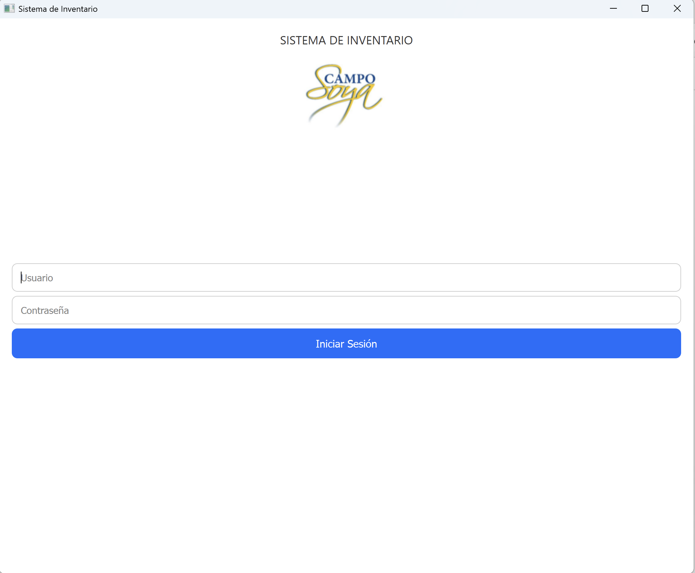
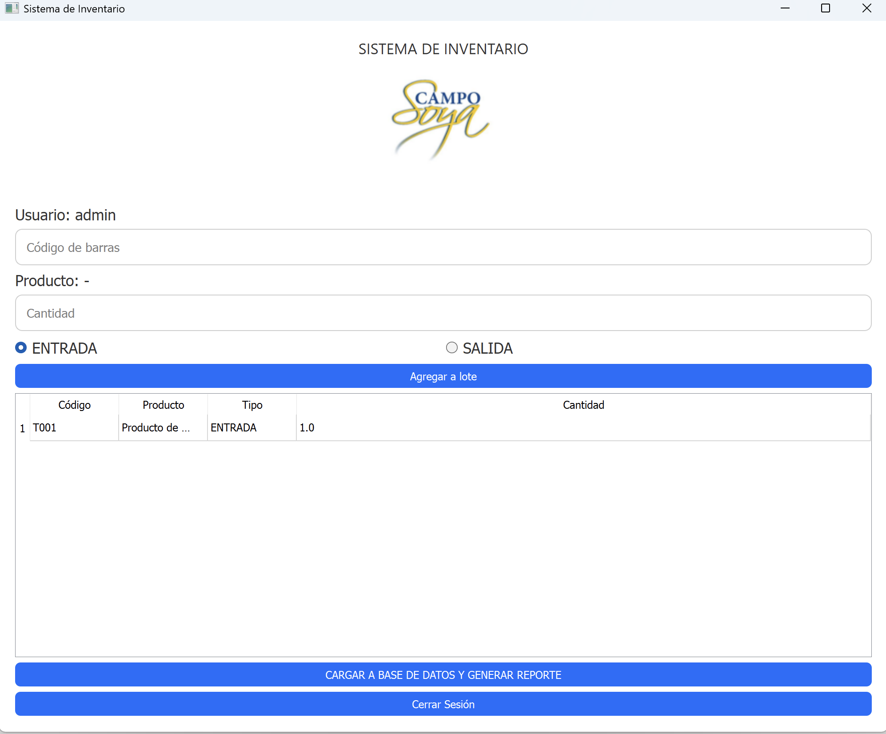
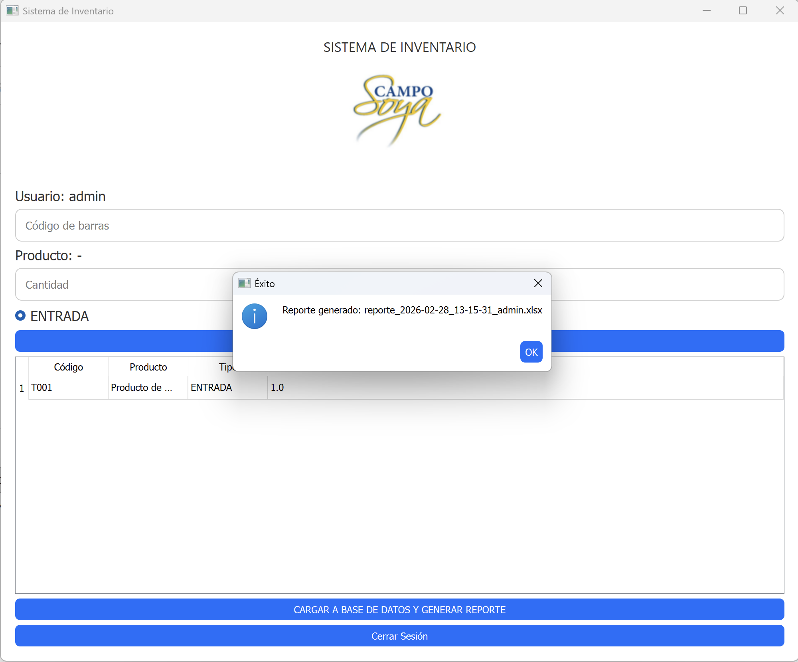

# 🧾 Inventory Management System

A desktop-based inventory management system built with Python and PySide6, designed for small and medium-sized businesses that require efficient control of products, batches, and stock movements.

---

## 🚀 Features

- 🔐 User authentication with role-based access (Admin / Operator)
- 📦 Inventory tracking and batch management
- 📊 Real-time stock updates
- 🧾 Movement history logging
- 🖥️ Desktop interface built with PySide6
- 🗄️ PostgreSQL database integration

---

## 🧠 Problem Solved

Many small businesses rely on Excel-based systems that are prone to errors, lack traceability, and do not scale.

This system replaces manual processes with a structured and secure inventory workflow, enabling:

- Better stock control
- Reduced human error
- Auditability of operations
- Multi-user access

---

## 🏗️ Architecture

- **Frontend:** PySide6 (Qt for Python)
- **Backend logic:** Python
- **Database:** PostgreSQL
- **Security:** Hashed passwords + role-based access

---

## 📸 Screenshots

### Login


### Inventory Dashboard


### Batch Management


---

## ⚙️ Installation

1. Clone the repository:

```bash
git clone https://github.com/JSebastianCaicedo/inventory-management-system.git
cd inventory-management-system